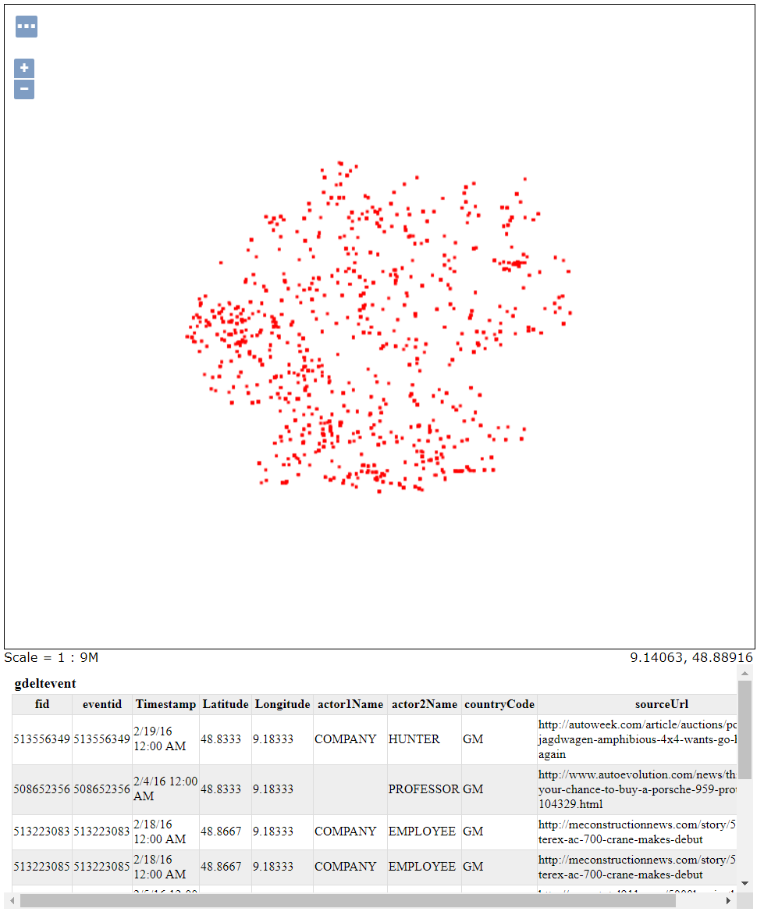
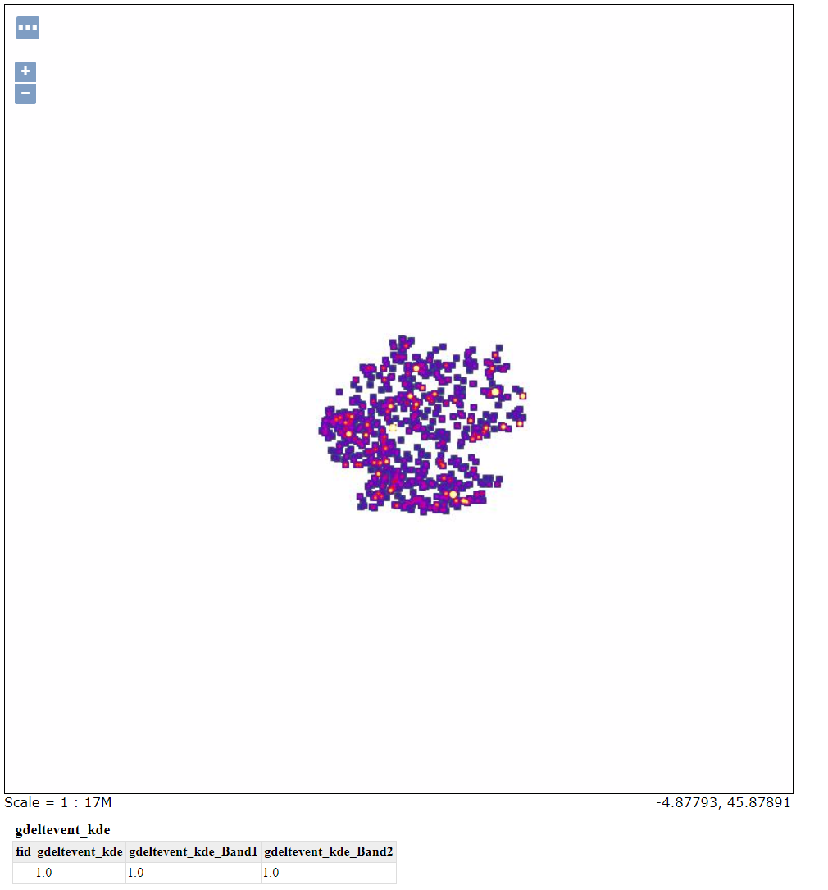
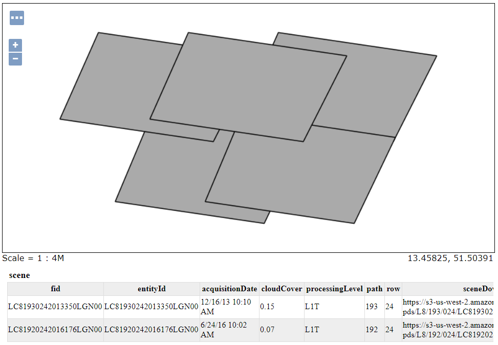
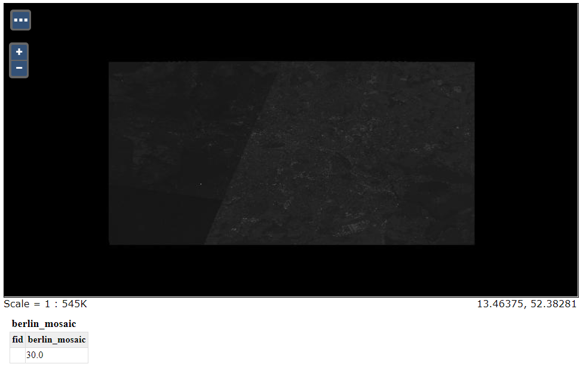

<<<

:linkattrs:

image::images/geowave-icon-logo-cropped.png[width="28%"]
== GeoWave Quickstart Guide Integrate with GeoServer 

In order to view the images generated from the vector and raster demos, use the GeoServer web interface. The following command configures and restarts GeoServer.

=== Configure GeoServer

SandBox

[source, bash]
----
geowave config geoserver sandbox.hortonworks.com:8993
----

EMR

[source, bash]
----
geowave config geoserver "$HOSTNAME:8000"
----

=== Add Layers and Styles

Add the layers for the demo(s) that you have completed.

==== Vector Demo Layers

- Add layers for the point and kde representations of the data.

[source, bash]
----
geowave gs layer add gdelt
geowave gs layer add gdelt-kde
----

- Download and add the KDEColorMap and SubsamplePoints styles.

The KDEColorMap style is needed for the heatmap we produced with the KDE. The SubsamplePoints style will be used for the gdeltlayer.

[source, bash]
----
cd /mnt
sudo wget s3.amazonaws.com/geowave/${version_url}/scripts/emr/quickstart/KDEColorMap.sld
sudo wget s3.amazonaws.com/geowave/${version_url}/scripts/emr/quickstart/SubsamplePoints.sld
geowave gs style add kdecolormap -sld /mnt/KDEColorMap.sld
geowave gs style add SubsamplePoints -sld /mnt/SubsamplePoints.sld
----

- Set the styles of these layers.

[source, bash]
----
geowave gs style set gdeltevent_kde --styleName kdecolormap
geowave gs style set gdeltevent --styleName SubsamplePoints
----

- Viewing the layers in GeoServer

In a browser go to http://localhost:8080/geoserver/ -  and you should see the GeoServer Welcome page

image::images/sandbox/geoserver-only-cropped.png[width="75%"]

Click on the Layer Preview link and you should see the gdeltevent and gdeltevent_kde layers in the Layer List table

.GeoServer Layer Preview List with Vector Demo Layers
image::images/sandbox/geoserver-vector-points-kde-layers-cropped.png[]

Click on the OpenLayers link and you will see the layers

.gdeltevent layer

.gdeltevent_kde layer

==== Raster Demo Layers

- Add the layers created in the raster demo. The default styles for these layers is sufficient.

[source, bash]
----
geowave gs layer add landsatraster
geowave gs layer add landsatvector --add ALL
----
Click on the Layer Preview link and you should see the scene and berlin_mosaic layers in the Layer List table

.GeoServer Layer Preview List with Raster Demo Layers
image::images/sandbox/geoserver-raster-layers-cropped.png[width="75%]

.scene layer

.berlin_mosaic layer

=== Cluster Interaction

- link:interact-cluster.html[Interacting with the cluster, window="_blank"]

=== Back to the Demos

- link:walkthrough-vector.html[Vector Demo, window="_blank"]
- link:walkthrough-raster.html[Raster Demo, window="_blank"]
