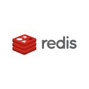

<<<

_v${project.version}_

// image::images/geowave-icon-logo-cropped-v2.png[width="18%"]  
= GeoWave Standalone Installer 

== Introduction

The Standalone Installer is designed to allow a user to run end-to-end tests of the GeoWave capabilities on a personal computer.  GeoWave's primary strength is with massive datasets that would typically require a distributed cluster of computers.  While GeoWave supports a number of key/value stores, the installer only bundles embedded versions of redis, RocksDB, Apache HBase(TM) and Apache Accumulo(TM).

image:images/hbase.png[width="20%"]

The Standalone installer uses https://www.ej-technologies.com/products/install4j/overview.html[Install4J] to build multi-platform installers.

* link:https://geowave.s3.amazonaws.com/${version_url}/standalone-installers/geowave_windows-x64_${tag.version}.exe[Windows]
* link:https://geowave.s3.amazonaws.com/${version_url}/standalone-installers/geowave_macos_${tag.version}.dmg[Mac]
* link:https://geowave.s3.amazonaws.com/${version_url}/standalone-installers/geowave_unix_${tag.version}.sh[Linux].

